# 🌞focusAutomation
### ▶️Context
I was reading a book called "HyperFocus" By - Chris Bailey. In a chapter, Chris advised readers to look into what is occupying their attentional space in order to decide that if they have gone into autopilot mode or not. If yes, then just recall the targets for the time and get into Hyperfocus mode.
## ▶️About the automation
This automation pop-ups a text GUI dialog box every 15-30 minutes after the user logs in to the system and sends a notification to the user asking about his attentional space and the user has to write the answer in the GUI dialog box and press save and close the window. This automation then saves the data with time and date to a file on your machine which you can lookat later and decide how often you slip into autopilot mode.
## ▶️Reason of making focusAutomation
It is a hard task remembering to look into your attentional space after some time. So I thought why not automate it.
## ▶️How it can help you?
It will remind you to look into your attentional space and decide if you have slipped into autopilot mode and get into hyperfocus mode ASAP.
# ⚙️Set up on Windows

### 👍Requirements
1. You must have python installed.
2. You must have these dependencies installed  
```time, tkinter, winotify```
3. Look into the file **BAT file** and **Python scripts** for the keywords ```#CHANGE ACCORDING TO YOU``` and change the Paths.

### 💯Setting up Task Scheduler
#### 🟢 Green color - Settings to be changed
#### 🔴 Red color - Final botton  
1. Search for Task Scheduler and open it from the windows search.  
2. After opening it ,look at the left pane and click on ```Create Basic Task```.
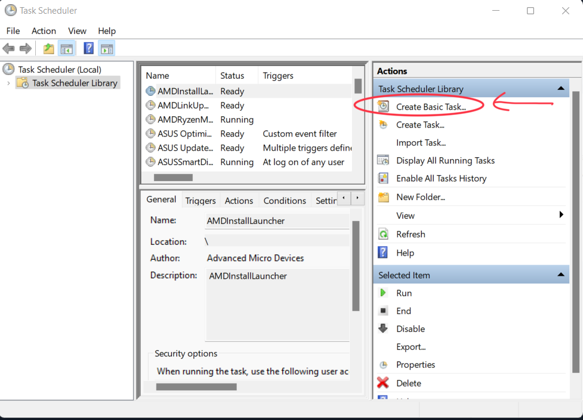
  
3. A window will open and ask you for name and description of the task. Enter the Information according to you and click the final button(Indicated with red color).
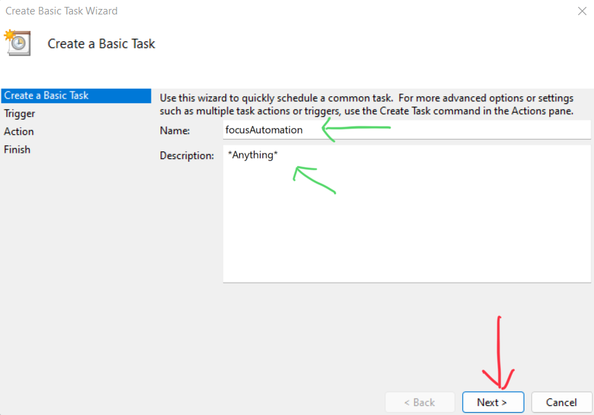
  
4. Select the trigger event you want to set. 
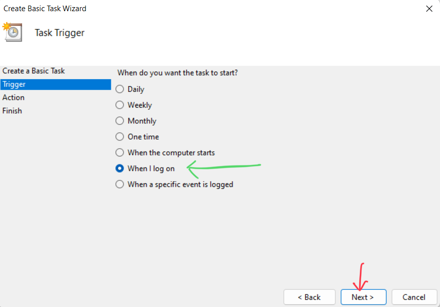 
  
5. Select the action you want to take upon triggering a event.  
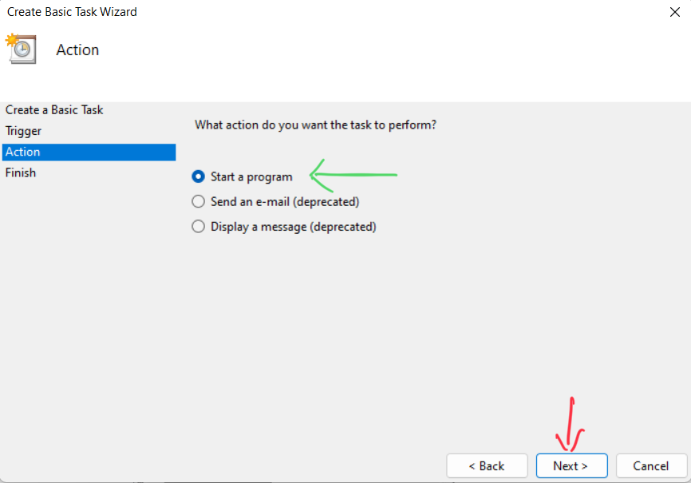
  
6. Select a program that you want to start. We have to select the BAT file by browsing to the repository. 
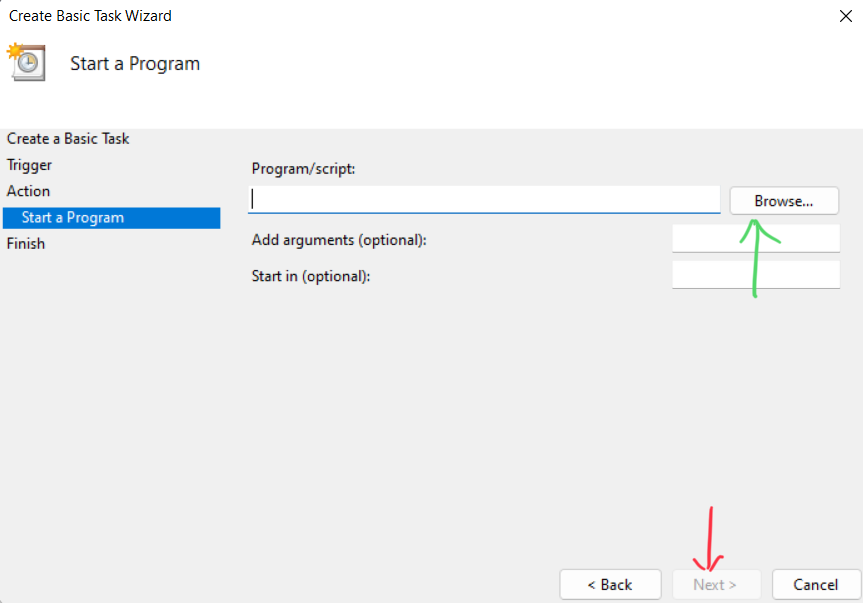 
  
7. Take a final look at the setting you have selected.  
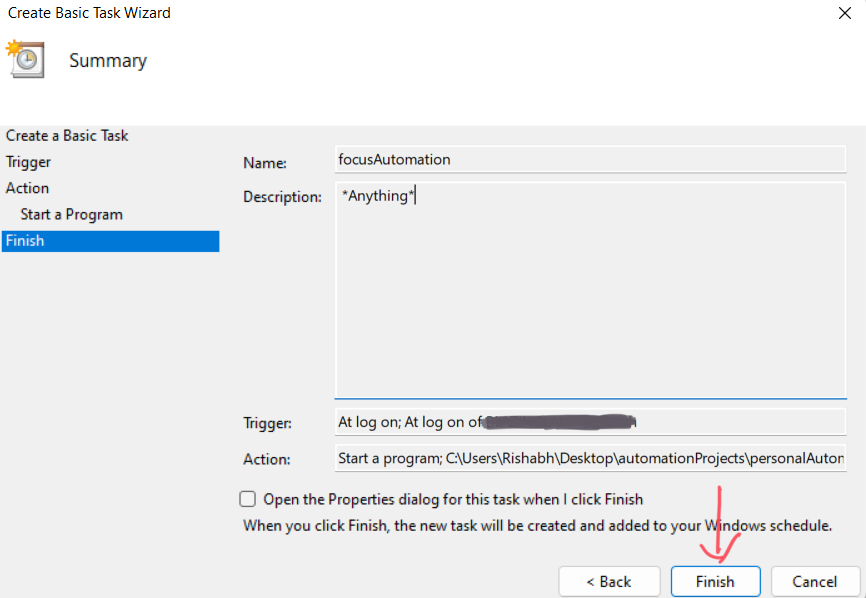
  
8. from the middle pane search for the name of your automation and right click and select Properties.  
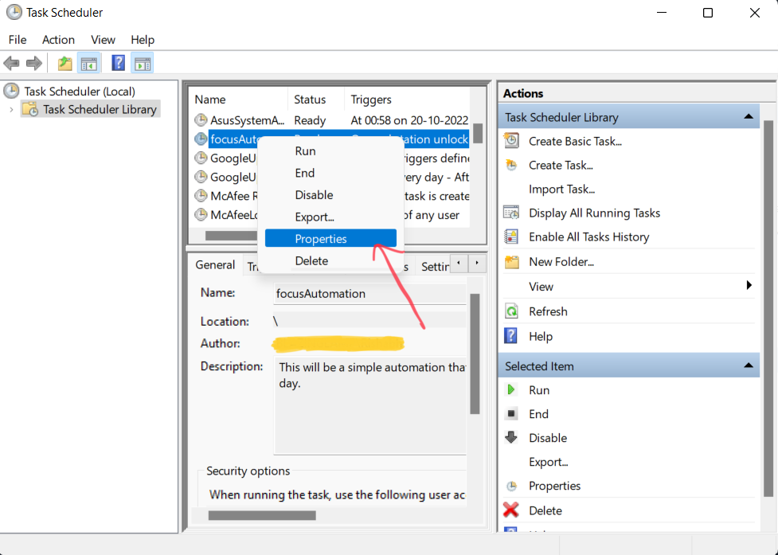
  
9. Now follow through the pictures for the ideal settings to set the automation correctly.  
**Change the settings that are shown with green color arrow to the shown setting and press the buttons shown with the red arrow.**  
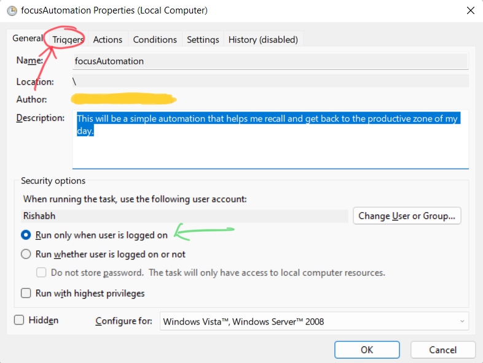  

10. 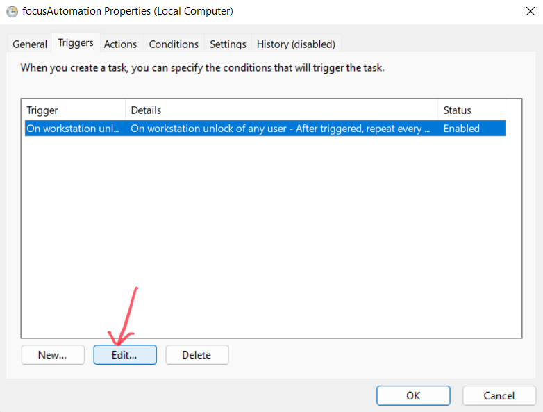  

11. 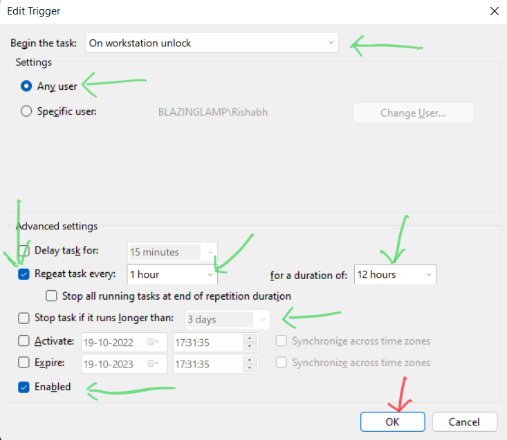  

12. 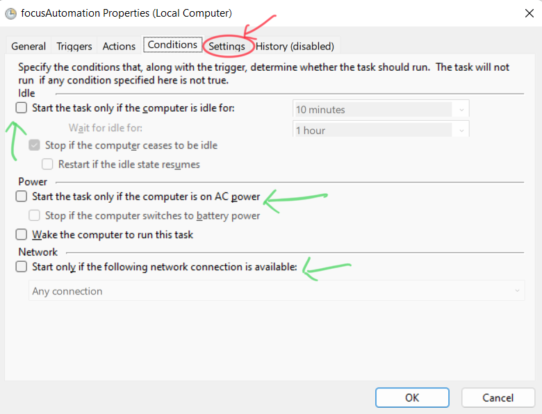  

13. 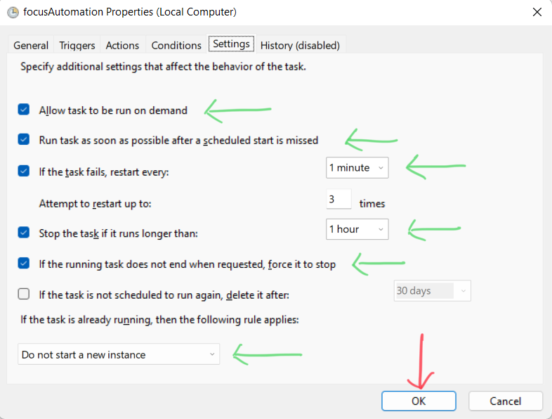  


### 🤝 Contribution Ideas

1. Make it available for Android, Mac, Linux.  
2. Make a centralised location of dumping data for all the OSs.  
